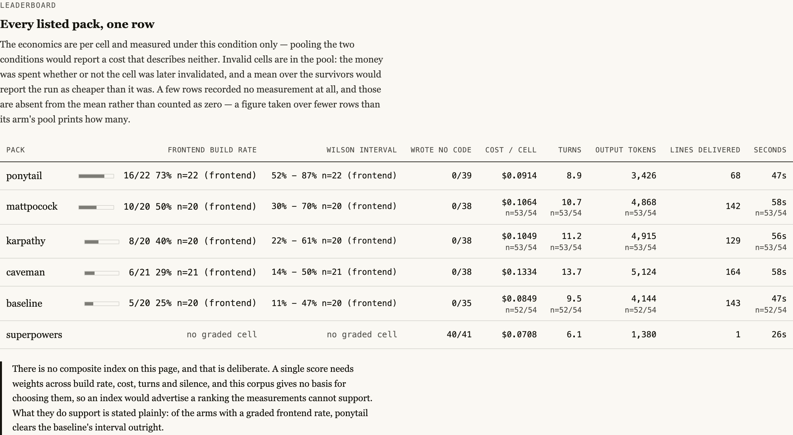
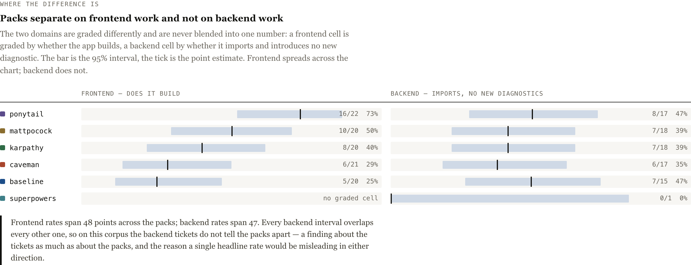
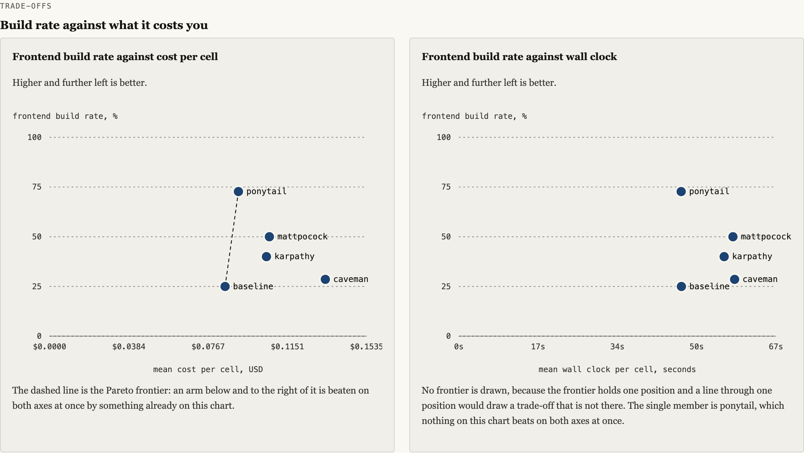
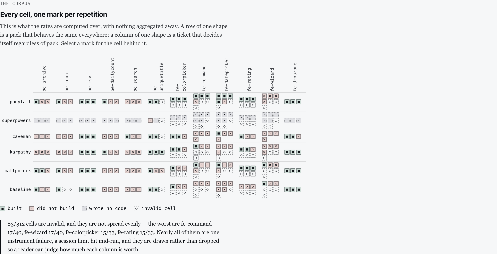
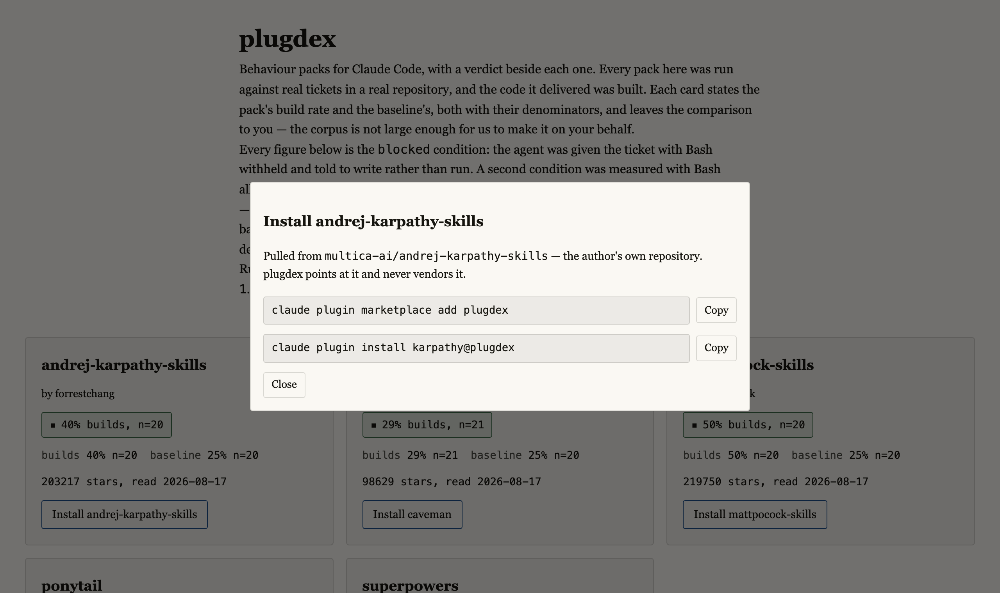

# plugdex

**Agent behaviour packs, measured by whether the code they wrote builds.**

Ponytail, superpowers, caveman, Karpathy's `CLAUDE.md`, Matt Pocock's skills, and whatever
ships next week. Browse them in one place, install them with one command, and see what
actually happened when we ran them.

Every pack advertises a headline: less code, fewer tokens, lower cost. Those are real
measurements. They are also, in every published benchmark we could find, measured **without
checking that the delivered code compiles**. plugdex runs each pack against the same tickets
in the same repository, builds what it delivers with that repository's own toolchain, and
publishes every cell beside the listing.



## What the measurements say

All figures below are the **`blocked` condition** — Bash withheld, the agent told to write
rather than run — over 312 cells, 229 of them valid. The other condition ran at a smaller
sample and is reported separately rather than averaged in, because averaging them produces a
rate that describes neither.

- **Frontend work separates the packs; backend work does not.** Frontend build rates run
  from 25% (no pack) to 73%; backend rates sit between 35% and 47% for every arm, with every
  interval overlapping every other one. On this corpus the backend tickets cannot tell the
  packs apart — a finding about the tickets as much as about the packs.
- **The two are graded by different gates and are never blended.** A frontend ticket is
  graded by whether the repository's own build accepted the delivered code; a backend ticket
  by whether that code imports and introduces no new lint or type diagnostic. No test suite
  runs for a backend ticket. Until this was published, the headline rate on every card
  counted frontend cells only and said nothing about it.
- **One widely installed pack writes no code at all** in an unattended session. `superpowers`
  produced code in 1 of 41 valid cells; it classifies the ticket, asks a clarifying question,
  and stops. It is also the cheapest and fastest arm on the board, which is what "does
  nothing" looks like in a cost column.
- **Only one pack separates from the baseline outright.** `ponytail`'s 95% interval
  (52–87%) starts above where the baseline's ends (11–47%). Every other measured pack's
  interval overlaps the baseline's, so at these sample sizes they are not distinguishable
  from installing nothing.
- **The corpus is thin in a specific place, and says so.** 83 of 312 cells are invalid, 74
  of them from a single instrument failure, and they cluster on the frontend tickets.

There is **no composite index** on the site. A single score would need weights across build
rate, cost, turns and silence, and this corpus gives no basis for choosing them — an index
would advertise a ranking the data cannot support.

### Where each pack is strong



One spoke per ticket. The solid shape is the measured rate; the pale shape behind it is the
upper bound of the 95% interval. Every spoke rests on about three repetitions, so the pale
shape is enormous — which is the honest reading, and the reason this project publishes cells
rather than a ranking.

### What it costs you



### Every cell, nothing aggregated away



## Two faces, one dataset

| | |
|---|---|
| **the site** | a browsable catalogue and analysis — a card per pack, a verdict chip, an install button, and the cells behind every number |
| **the registry** | a generated Claude Code marketplace: `claude plugin marketplace add plugdex` adds every listed pack by name, and the site says which of them actually install — 4 of 5 today. A listing whose upstream stopped installing keeps its card and its figures and is labelled; the install record is regenerated by a real install, never asserted |



The registry points at each pack's own repository. plugdex indexes; it does not vendor
anyone's code.

### Does the listing still install?

Every listing carries a recorded install state, written by a real
`claude plugin install` and re-checked on every run. It is not decoration: on 2026-08-18 an
upstream pack added a manifest field the CLI rejects, and this catalogue's own gate caught it
within a day of the measurement it publishes.

A pack recorded as blocked that starts installing again is a **failure**, not a pass — the
record is stale and has to be refreshed. Without that rule, marking a pack broken would be a
way to silence the check forever, and the honest record would be the one nobody could afford
to write.

## Status

Early, and built ticket by ticket on measurements already in this repository:
[`bench/`](bench/) holds the harness and every graded run, imported with its history intact
so a preregistration still provably precedes the runs it predicts. A number reaches the site
from a fingerprinted record or it does not reach the site (DATA-01).

The screenshots above are rendered from the analysis page as it is built today, not from a
mockup. Both pages — the catalogue and the analysis — are in the repository and build from
the same records.

## Withdrawals

Claims this project has published and then retracted stay reachable, with the original
number, the cause, and what replaced it (CLAIM-01). This applies to the README as well: an
earlier version of this file said "roughly half the delivered code does not build" without
naming a condition, and reported a no-code figure of 68 of 69 cells. Both are corrected
above — the first pooled two conditions whose rates are 56% and 17%, and the second matched
neither pool's count. A benchmark that only shows its wins is a brochure.

A third, withdrawn 2026-08-20: this file and `CLAUDE.md` both said the marketplace
"makes every listed pack installable by name". That was false the day it was written and
the repository's own records said so — `.claude-plugin/marketplace.json` lists `caveman`
while `packages/registry/installability/caveman.json` has recorded `"outcome": "blocked"`
since 2026-08-18, with the CLI's verbatim error. Re-measured on 2026-08-20 against a
*newer* upstream commit than the record names, it still fails the same way. The sentence is
replaced above with the count and a pointer to where the site states it per listing. The
site had the same gap and closed it in the same change (PDX-024); this entry exists because
the front door kept the claim for two days after the record contradicted it.

## Development

Work runs a 9-stage gate cycle — ticket, plan, cross review, test first, implement, verify,
report, cross review — where "done" means a script exited zero.

- [`CLAUDE.md`](CLAUDE.md) — project instructions and rules
- [`DESIGN.md`](DESIGN.md) — normative spec, reference designs, decision log
- [`docs/WORKFLOW.md`](docs/WORKFLOW.md) — the full workflow spec

```bash
./scripts/install-hooks.sh   # once per clone
./scripts/verify.sh          # the whole gate stack
./scripts/check-gates.sh     # the test for the gates
```

## Listing or removing a pack

Every listing names its author and links upstream (SRC-01). If you wrote a pack and want it
listed, corrected, or removed, open an issue — a removal request is honoured without
argument.

## License

MIT
