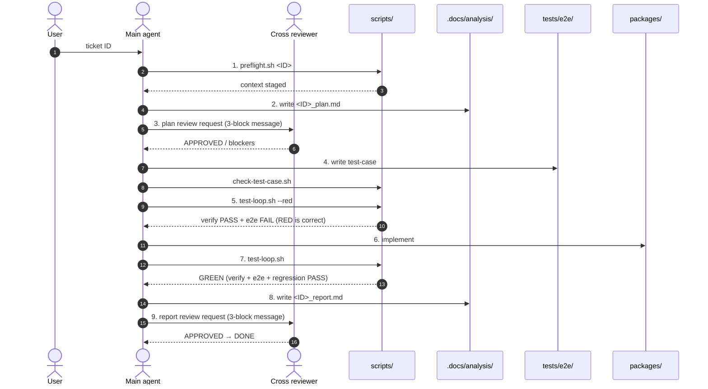

# Workflow

> Ticket / TDD / cross review / automation. Ported wholesale from the orangerail
> harness (itself the TS-ported lineage of toklint's 9-stage gate system) and
> re-pointed at plugdex — a static catalogue with a machine-readable registry. Every
> artifact in this repository is written in English (LANG-01, see CLAUDE.md — and
> unlike the lineage, there is **no allowlist**). plugdex adds three gates the lineage
> never had, because plugdex publishes other people's work and its own numbers:
> DATA-01, CLAIM-01, SRC-01 (see §3).

## Contents

1. [Overview](#1-overview)
2. [The 9-Stage Gate Cycle](#2-the-9-stage-gate-cycle)
3. [Rules](#3-rules)
4. [Automation scripts](#4-automation-scripts)

---

## 1. Overview

Work is not "just write code". One ticket ID from the user starts a full cycle:
**ticket → plan → cross review → tests first → implement → verify → report → cross
review**. The human intervenes once (the ticket ID); deterministic gate scripts and
heterogeneous-model cross review enforce quality from there. The judge of "done" is a
script exit code — not the AI's claim, not a feeling.

## 2. The 9-Stage Gate Cycle

### 2.1 Stage artifacts + gates

| # | Stage | Artifact | Gate command |
|---|---|---|---|
| 1 | preflight | staged context | `./scripts/preflight.sh <ID>` |
| 2 | plan | `.docs/analysis/<ID>_plan.md` | — |
| 3 | plan review | reviewer verdict section | `./scripts/agent-review.sh plan .docs/analysis/<ID>_plan.md` |
| 4 | test-case | `tests/e2e/<ID>-*.sh` | `./scripts/check-test-case.sh <ID>` |
| 5 | RED check | e2e failure confirmed | `./scripts/test-loop.sh <ID> --red` |
| 6 | implement | `packages/` changes | — |
| 7 | GREEN check | verify + e2e + regression PASS | `./scripts/test-loop.sh <ID>` |
| 8 | report | `.docs/analysis/<ID>_report.md` | — |
| 9 | report review | reviewer verdict section | `./scripts/agent-review.sh report .docs/analysis/<ID>_report.md` |

### 2.2 Gate blocking policy — loop until PASS

Every gate retries until PASS. If any stage returns BLOCK / FAIL, do not advance: fix
the document / code / test-case and re-run the **same** gate.

- **Tests** — if `test-loop.sh` FAILs (verify, e2e, or regression), fix code and
  re-run. Repeat until all three PASS.
- **Cross review** — if a reviewer answers BLOCK or NEEDS_REVISION, revise and
  re-request. Repeat until APPROVED (or APPROVED_WITH_NOTES with 0 blockers).
- **Rules / quality checks** — if `check-language.sh` (or any other rule gate) finds a
  BLOCK, fix and re-verify. Repeat until 0 BLOCKs.

### 2.3 The RED stage (5) — guaranteeing real TDD

Without an explicit RED stage, a test-case may already PASS before implementation — a
fake cycle. The RED gate requires both conditions simultaneously:

- `verify` (check-language + check-structure + check-gates + check-no-llm +
  check-templates + typecheck + lint + test + build) PASS
- the ticket's `e2e` scenario FAIL

Only after RED passes does implementation flip it to GREEN, which proves the change is
what actually made the e2e scenario live.

### 2.4 Cross-review message structure (stages 3, 9)

Each plan / report is reviewed by a different agent/model than the author. Every review
request contains three blocks:

1. **Current context** — ticket ID / stage / last result / affected files / relevant rules
2. **Question / request** — decision-form ("which of X or Y better satisfies D4")
3. **Expected output** — format / length / where it will be used

This prevents one-line free-form queries from drifting into courtesy answers.
`agent-review.sh prompt` generates the prompt in this exact shape — including the
mandatory rubric scorecard (REV-01): plan items P1–P7 / report items R1–R6, each scored
PASS / FAIL / N/A with one line of concrete evidence. The verification mode checks the
scorecard mechanically, so a courtesy APPROVED without grounded judgments cannot pass
the gate.

## 3. Rules

Deterministic gates active in this repository:

| ID | Rule | Gate |
|---|---|---|
| LANG-01 | All repository artifacts in English — zero Hangul in tracked files. **No allowlist**: the lineage exempted a Korean spec, plugdex exempts nothing. Golden case 11 asserts the list stays empty | `./scripts/check-language.sh` (verify.sh step 1) |
| CR-01 | No commit / push / issue / PR / merge / release / deploy without explicit user instruction | reviewed in every report (CR-01 Compliance section) |
| ST-01..07 | Repository layout: root whitelist, packages registry (`site`, `data`, `registry`; absence allowed until each package's ticket), ticket & analysis & e2e naming (PDX-###), executable scripts | `./scripts/check-structure.sh` (verify.sh step 2, pre-commit) |
| GATE-01 | Gates must keep their teeth: every gate is regression-tested against a golden set of planted violations (catch + right rule + no false positive on clean trees) | `./scripts/check-gates.sh` (verify.sh step 3; corpus in `tests/meta/cases/`) |
| NOLLM-01 | Never bundle an LLM-inference SDK: no `packages/` manifest or source may depend on / import a blocklisted SDK. A catalogue that measures agents must not ship one. The blocklist at the top of the script is the single source of truth | `./scripts/check-no-llm.sh` (verify.sh step 4) |
| TMPL-01 | Issue / PR / ticket text must not drift: each drafted instance carries its template's required `## ` sections in order with non-empty bodies | `./scripts/check-templates.sh` (verify.sh step 5, pre-commit) |
| REF-01 | A mapped ticket's plan must show its required references opened (Y + note) in the "References Consulted" section, mirrored by rubric row P7. PDX-001 is exempt. Map: `DESIGN.md`, Reference Map | `./scripts/check-references.sh <plan>` (invoked by `agent-review.sh plan`) |
| STATE-01 | Stage order is enforced, not advised: later gates require earlier stage stamps (preflight → plan-reviewed → red → green → report-reviewed) | `./scripts/workflow-state.sh` (bypass only via loud `PLUGDEX_STATE_BYPASS=1`) |
| REV-01 | Cross reviews are scored against a fixed rubric (plan P1–P7 / report R1–R6), every row with evidence; the gate rejects a missing/unjudged row, an empty evidence cell, and APPROVED combined with any FAIL row | `./scripts/agent-review.sh` |
| OBS-01 | Every gate run is observable: one JSONL record per run appended to `.docs/scratch/gate-runs.jsonl`; logging never changes a verdict | `scripts/lib/gate-log.sh`; summary via `./scripts/gate-stats.sh` |
| DEV-01 | Non-scriptable behavior is declared, not skipped: behavior no gate can verify (whether a chip reads as a warning, how a card looks at 360px) gets a Non-Scriptable Verification checklist in the report — each row checked in a real browser or explicitly N/A | `_REPORT_TEMPLATE.md` §5 (presence enforced by `agent-review.sh report`) |

### 3.1 Rules this project adds — the reason the port was worth doing

plugdex republishes other people's packs and its own measurements. Those two facts
create failure modes the lineage never had to gate:

| ID | Rule | Why it is a gate and not a habit |
|---|---|---|
| DATA-01 | Every figure the site renders comes from a record in `packages/data`, and every record carries the environment fingerprint of the run that produced it. No number is typed into a component | A hand-typed statistic is one nobody can check, and it silently survives every re-measurement. The predecessor project published "the rate reproduced across two runs" and had to withdraw it — the two runs had different environments and different prompts, and nothing in the output said so |
| CLAIM-01 | A published verdict that turns out to be wrong is corrected in place; the previous value, the cause, and the replacement stay reachable on the site | Deleting a wrong number is worse than never publishing it. The withdrawal record is the only part of a benchmark a sceptical reader cannot get anywhere else |
| SRC-01 | Every listed pack links to its upstream repository, names its author, and records how they asked to be listed or removed. The registry points at that repository; it never vendors the code | We publish verdicts on other people's work. Attribution and an opt-out are the minimum, and pointing rather than copying keeps us a catalogue instead of a fork |

Each of these lands with its own ticket, its own e2e scenario, and its own golden-set
case — the same way every other gate in this repository earned its place.

## 4. Automation scripts

| Script | Role |
|---|---|
| `preflight.sh` | pre-work environment check + stages CLAUDE.md / DESIGN.md / ticket into context |
| `verify.sh` | check-language + check-structure + check-gates + check-no-llm + check-templates + `pnpm typecheck` + `pnpm lint` + `pnpm test` + `pnpm build` (Node steps WARN-skipped in empty-workspace mode until a `packages/*/package.json` exists) |
| `check-language.sh` | LANG-01 gate — greps tracked files for Hangul, BLOCK on any hit (no allowlist) |
| `check-structure.sh` | layout gate — root whitelist, packages registry, ticket/analysis/e2e naming, script executability |
| `check-no-llm.sh` | NOLLM-01 gate — BLOCK if a `packages/` manifest or source depends on / imports a blocklisted LLM SDK |
| `check-templates.sh` | TMPL-01 gate — tickets and PR drafts must match their templates' `## ` sections (presence / order / non-empty) |
| `check-references.sh` | REF-01 gate — a mapped ticket's plan must record its required references consulted (Y); PDX-001 exempt |
| `install-hooks.sh` | installs the pre-commit hook (language + structure + templates) — run once per clone |
| `check-test-case.sh` | per-ticket e2e scenario existence + mapping gate |
| `e2e.sh` | runs `tests/e2e/<ID>-*.sh` scenarios (each scenario is self-contained; no arg = full regression) |
| `test-loop.sh` | combined TDD gate: check-test-case + verify + ticket e2e + regression. `--red` for RED mode |
| `agent-review.sh` | plan / report review gate verification (incl. rubric scorecard REV-01) + 3-block reviewer prompt generation |
| `check-gates.sh` | gate self-test — plants each `tests/meta/cases/` violation in a sandbox and asserts the right gate blocks it; clean-tree baselines guard against false positives |
| `workflow-state.sh` | per-ticket stage stamps (`.docs/state/`, gitignored) — `stamp` / `require` / `show` / `reset` |
| `gate-stats.sh` | read-only observability dashboard over `.docs/scratch/gate-runs.jsonl` |
| `gh-submit.sh` | the only sanctioned way to open issues and PRs — derives title, body, assignee, labels |

All gate scripts are single-shot: they report PASS/FAIL and exit. The loop (fix →
re-run) is driven by the agent, the pass/fail decision by the script. Stage ORDER,
however, is not left to the agent: `workflow-state.sh` stamps each passed stage and
`agent-review.sh` / `test-loop.sh` hard-require the previous stamp, so RED cannot run
before plan approval and GREEN cannot run before a recorded RED.
